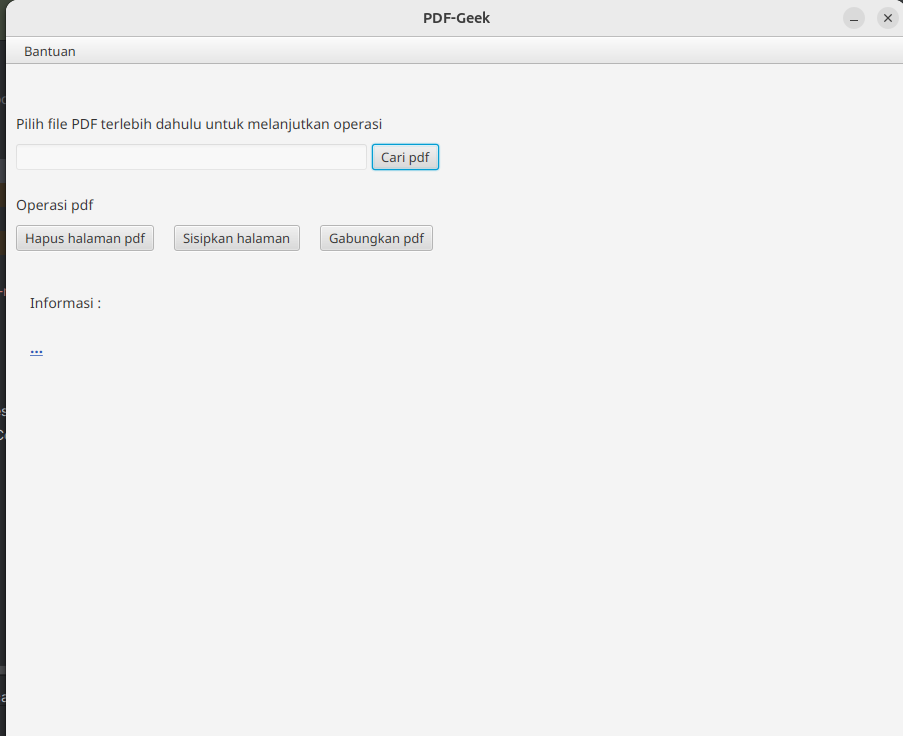
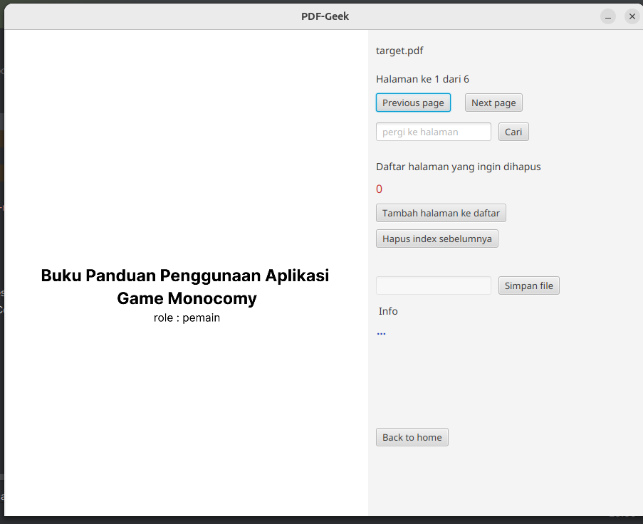

PDF-Geek merupakan fungsionalitas untuk file pdf yang dibangun dengan
javafx. 

Download di [drive](https://drive.google.com/file/d/10yW73swKhQ7BukTrrKY4ASzlhMtXxsrt/view?usp=sharing)

Info : 
- untuk linux menggunakan run.sh dan win run.bat
- saya belum coba di windows
- pastikan kalian beri akses eksekusi `chmod +x run.sh`

Kenapa bisa sampai 100mb+? Karena sdk javafx sudah tidak dibundle dengan jdk, 
ini sulit untuk membuat native.

Fitur : 
- Hapus halaman pdf
- Sisipkan halaman
- Gabung pdf

Dibangun dengan :
- java 21 graalvm
- maven
- scene builder

Cara menjalankan :
- install maven dan java 21
- `mvn install` 
- lalu jalankan main class

NOTE :
Sampai saat ini saya sudah berusaha untuk membuat native app
tetapi belum bisa, dikarenakan SDK Javafx sudah tidak dibundle
oleh JDK java. Saya sudah mencoba dengan jpackage, jlink dan
menggunakan jar lalu ke graalvm untuk native. Tetapi belum berhasil.

